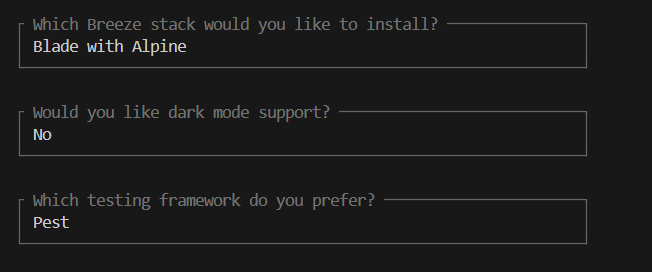

# documentation dev-web
## Compte-rendu du mini-projet

**Principe**  
- Laravel est un framework web basé sur PHP.  
- Après téléchargement, on utilise **Sail** (Docker) pour exécuter les commandes et configurer l'environnement.  
- Les migrations configurent la base de données.

**Création du projet**  
- Clonage du projet avec Git.  
- Installation des dépendances avec `composer install`.  
- Démarrage avec `sail up -d`.  
- Migration des données avec `sail php artisan migrate`.

**Modèles et migrations**  
- Création des modèles avec `sail php artisan make:model Nom -mc` (ex. : `Post`, `Comment`, `Reply`).  
- Configuration des relations entre les tables dans les modèles (One-to-Many, Many-to-One).  
- Ajout des champs dans les fichiers de migration pour chaque table (`posts`, `comments`, `replies`).

**Authentification avec Breeze**  
- Installation avec `sail composer require laravel/breeze --dev`.  
- Scaffolding des fonctionnalités d'authentification (`sail php artisan breeze:install`), compilation des assets (`sail npm run dev`) et tests sur les pages `/login` et `/register`.

**Controllers**  
- Gestion des actions via des contrôleurs comme `PostController`, `CommentController` et `ReplyController`.  
- Les contrôleurs organisent les requêtes entrantes, la logique métier et les interactions avec la base de données.

**Routes**  
- Configuration des routes dans `web.php` pour l'accès aux fonctionnalités (posts, commentaires, réponses).  
- Utilisation de middlewares pour sécuriser les pages (ex. : accès restreint aux utilisateurs connectés).

**Vues et Layouts**  
- Création de layouts (`main.blade.php`, `app.blade.php`) pour partager une structure commune (Bootstrap/Tailwind).  
- Vues spécifiques pour afficher, créer, et modifier les publications (`home.blade.php`, `create.blade.php`, etc.).  
- Organisation des blocs réutilisables dans des fichiers partiels (`partials`).


## Principe

Laravel est un framework pour créer des applications web. On commence par le télécharger, puis on utilise Sail (qui repose sur Docker) pour exécuter des commandes Laravel. Ensuite, on migre les données pour configurer la base de données avant de pouvoir commencer à développer l'application.

## Créer un nouveau projet LARAVEL

1. Vérifier l’accès au repo git distant puis cloner ce dernier :

```bash
git clone <url_repo_git
```

1. Copier le fichier .env.example de notre environnement Laravel dans le dossier cloné si il n’y est pas :

```bash
cp .env.example <chemin_vers_le_dossier_cloné>
```

1. Lancer le gestionnaire **Composer** pour installer les dépendances dans le répertoire `vendor` de votre projet local 

```bash
docker run --rm --interactive --tty --volume $PWD:/app composer install
```

1. Lancer cette commande pour démarrer l’environnement Docker configuré spécialement pour  Laravel

```bash
./vendor/bin/sail up -d
```

1. On va ensuite faire la migration de donnée :

```bash
./vendor/bin/sail artisan migrate
```

⚠️ ATTENTION ! Il se peut qu’il y est une erreur du type :

```bash
Error response from daemon: driver failed programming external connectivity on endpoint blog_laravel-meilisearch-1 (118ec04adcb26925a699bf396931b2cbb553ec1b71ce5ee1d27cafa56b9e2085): Bind for 0.0.0.0:7700 failed: port is already allocated
```

Il faut aller dans le fichier .env et remplacer la variable APP_URL=http://localhost par APP_URL=http://127.0.0.1

## **2 - Models, migrations et controllers**

Avant toute chose pour faciliter les futurs commandes nous allons créer un alias qui permettra d’utiliser **sail** plus facilement 

Placez-vous dans le répertoire de travail :

```bash
cd /home/avignaud/dev-web/minimalist-blog-laravel 
```

Créer l’allias pour lancer l’application sail avec la simple commande ‘sail’ :

```bash
alias sail='[ -f sail ] && sh sail || sh vendor/bin/sail'
```

On peut ensuite le lancer simplement avec la commande :

```bash
sail up -d
```

On va ensuite créer nos premier modèle qui sont l’équivalent des tables dans les bases de données:

Création du modèle post :

```bash
sail php artisan make:model Post -mc

```

-m permet  créer  une **migration** associée au modèle. Cela génère un fichier de migration dans le dossier `database/migrations`, qui peut être utilisé pour créer ou modifier la table correspondante dans la base de données.

-c créé  un **contrôleur** pour le modèle. Cela génère un fichier contrôleur dans le dossier `app/Http/Controllers`, permettant de gérer la logique liée à ce modèle (ex : gestion des routes, traitements).

On peut ensuite faire cette commande pour les modèles Comment et Reply :

```bash
sail php artisan make:model Comment -mc
sail php artisan make:model Reply -mc
```

*infos: artisan est simplement  l'interface en ligne de commande  de Laravel*

On va ensuite ajouter des champs à nos tables , pour cela on va modifier les fichiers de migrations créer avec le ‘-m’ :

Pour `2025_01_20_075956_create_posts_table.php`, modifier la fonction up comme ceci :

```php
Schema::create('posts', function (Blueprint $table) {
            $table->bigIncrements('id');
            $table->unsignedInteger('user_id');
            $table->string('title');
            $table->text('body');
            $table->timestamps();
```

Pour `2025_01_20_075956_create_comments_table.php`, modifier la fonction up comme ceci :

```php
Schema::create('comments', function (Blueprint $table) {
            $table->bigIncrements('id');
            $table->unsignedBigInteger('user_id'); 
            $table->unsignedBigInteger('post_id'); 
            $table->text('body'); 
            $table->timestamps();
```

Pour `2025_01_20_075956_create_replies_table.php`, modifier la fonction up comme ceci :

```php
Schema::create('replies', function (Blueprint $table) {
            $table->bigIncrements('id');
            $table->unsignedBigInteger('user_id'); 
            $table->unsignedBigInteger('comment_id'); 
            $table->text('body'); 
            $table->timestamps();
```

On va ensuite établir les relations entres les tables, (équivalent des flèches sur le schéma) :

On commence par ajouter la relation **‘one-to_many’**, (la flèche qui va de la table user vers la table posts sur users_id) :

Dans le fichier `app/Models/User.php`, modifier la fonction up comme ceci :

*il faut ajouter la fonction dans la class User*

```php
public function posts() 
{
    return $this->hasMany(Post::class, 'user_id');
}
```

Pour  `app/Models/Post.php` :

```php
<?php

namespace App\Models;

use Illuminate\Database\Eloquent\Model;

class Post extends Model
{
    // table name to be used
    protected $table = 'posts';

    // columns to be allowed in mass-assingment 
    protected $fillable = ['user_id', 'title', 'body'];

    /* Relations */

    // One to many inverse relationship with User model
    public function owner() {
    	return $this->belongsTo(User::class, 'user_id');
    }

    // One to Many relationship with Comment model
    public function comments()
    {
    	return $this->hasMany(Comment::class, 'post_id');
    }

    /**
     * get show post route
     *
     * @return string
     */
    public function path()
    {
        return "/posts/{$this->id}";
    }
}

```

Pour  `app/Models/Comment.php` :

```php
<?php

namespace App\Models;

use Illuminate\Database\Eloquent\Model;

class Comment extends Model
{
    # table name to be used by model
    protected $table = 'comments';

    # columns to be allowed in mass-assingment
    protected $fillable = ['user_id', 'post_id', 'body'];

    /** Relations */

    # One-to-Many inverse relation with User model.
    public function owner()
    {
        return $this->belongsTo(User::class, 'user_id');
    }

    # One-to-Many inverse relation with Post model.
    public function post()
    {
    	return $this->belongsTo(Post::class, 'post_id');
    }

    # One-to-Many relation with Reply model.
    public function replies()
    {
    	return $this->hasMany(Reply::class, 'comment_id');
    }
}

```

Pour  `app/Models/Reply.php` :

```php
<?php

namespace App\Models;

use Illuminate\Database\Eloquent\Model;

class Reply extends Model
{
    // Table name to be used by the model.
    protected $table = 'replies';

    // Columns to be used in mass-assignment.
    protected $fillable = ['user_id', 'comment_id', 'body'];

    /** Relations */

    // One-to-Many inverse relation with User model.
    public function owner()
    {
        return $this->belongsTo(User::class, 'user_id');
    }

    // One-to-Many inverse relation with Comment model.
    public function comment()
    {
        return $this->belongsTo(Comment::class, 'comment_id');
    }
}

```

## Authentification :

Laravel propose des kits de démarrage pour vous aider à créer rapidement une application avec des fonctionnalités prêtes à l'emploi (authentification, enregistrement, etc.). Ces kits ne sont pas obligatoires, mais ils simplifient beaucoup le travail initial.

Laravel Breeze est l'un de ces kits. Il permet de mettre en place facilement l'authentification et les éléments de base d'une application Laravel.

Installation de Laravel BReeze avec sail :

```php
sail composer require laravel/breeze --dev
```

Scaffold de Breeze :

Le **scaffold de Breeze** automatise la création des composants nécessaires pour un système d'authentification complet (routes, contrôleurs, vues). Cela permet de démarrer rapidement sans avoir  besoin de tout configurer manuellement et  tout en ayant la flexibilité de personnaliser le code généré.

```php
sail php artisan breeze:install
```

Choisir ces options pour l’installation :



Compiler les assets frontend (CSS et JavaScript) :

Cette étape prépare et optimise les fichiers CSS et JS pour qu'ils soient utilisables par notre application.

```php
sail npm install
sail npm run dev
```

Faire la migration des données :

```php
sail php artisan migrate 
```

On va ensuite tester si ça fonctionne en allant dans aux pages `/login`, `/register` on va essayer de créer un compte et de s’y connecter 


## Les routes :

Nous allons rendre notre application accessible via la route */home*, pour cela nous allons modifier le fichier routes/web.php

```php
<?php

use Illuminate\Support\Facades\Route;

use App\Http\Controllers\CommentController;
use App\Http\Controllers\HomeController;
use App\Http\Controllers\PostController;
use App\Http\Controllers\ReplyController;

/*
|--------------------------------------------------------------------------
| Web Routes
|--------------------------------------------------------------------------
|
| Here is where you can register web routes for your application. These
| routes are loaded by the RouteServiceProvider within a group which
| contains the "web" middleware group. Now create something great!
|
*/

Route::get('/', function () {
    return view('welcome');
});

Route::get('/dashboard', function () {
    return view('dashboard');
})->middleware(['auth'])->name('dashboard');

require __DIR__.'/auth.php';

// group the following routes by auth middleware - you have to be signed-in to proceeed
Route::group(['middleware' => 'auth'], function() {
	// Dashboard
	Route::get('/home', [HomeController::class, 'index'])->name('home');

	// Posts resourcefull controllers routes
	Route::resource('posts', PostController::class);

	// Comments routes
	Route::group(['prefix' => '/comments', 'as' => 'comments.'], function() {
        // store comment route
		Route::post('/{post}', [CommentController::class, 'store'])->name('store');
	});

	// Replies routes
	Route::group(['prefix' => '/replies', 'as' => 'replies.'], function() {
        // store reply route
		Route::post('/{comment}', [ReplyController::class, 'store'])->name('store');
	});

	// Update v10
    	Route::get('/profile', [ProfileController::class, 'edit'])->name('profile.edit');
    	Route::patch('/profile', [ProfileController::class, 'update'])->name('profile.update');
    	Route::delete('/profile', [ProfileController::class, 'destroy'])->name('profile.destroy');
});
```

## Les vues :

Le but de ce code est de construire une **interface utilisateur dynamique** pour l'application Laravel, en utilisant des **vues Blade** pour afficher, organiser, et gérer les **publications (posts)**.

1 - Nous allons créer l'arborescence de dossier *resources/views/posts/partials* pour héberger nos blocks de code. 

```bash
cd /home/avignaud/dev-web/minimalist-blog-laravel/resources/views
mkdir posts
cd posts
mkdir partials
```

2 - Créer le fichier home.blade.php dans `resources/views/`

```bash
nano home.blade.php
```

Et mettre ce contenu :

```php
@extends('layouts.main')

@section('content')

<div class="clearfix">
    <h2 class="float-left">Liste de tous les sujets</h2>

    {{-- link to create new post --}}
    <a href="{{ route('posts.create') }}" class="btn btn-link float-right">Créer une nouvelle publication</a>
</div>

{{-- List all posts --}}
@forelse ($posts as $post)
    <div class="card m-2 shadow-sm">
        <div class="card-body">

            {{-- post title --}}
            <h4 class="card-title">
                <a href="{{ route('posts.show', $post->id) }}">{{ $post->title }}</a>
            </h4>

            <p class="card-text">
                
                {{-- post owner --}}
                <small class="float-left">Par: {{ $post->owner->name }}</small>

                {{-- creation time --}}
                <small class="float-right text-muted">{{ $post->created_at->format('M d, Y h:i A') }}</small>
                
                {{-- check if the signed-in user is the post owner, then show edit post link --}}
                @if (auth()->id() == $post->owner->id )
                    {{-- edit post link --}}
                    <small class="float-right mr-2 ml-2">
                        <a href="{{ route('posts.edit', $post->id) }}" class="float-right">éditer votre publication</a>
                    </small>
                @endif
            </p>
        </div>
    </div>
@empty
    <p>Aucune publication créée pour l'instant !</p>
@endforelse

@endsection
```

On va ensuite créer  le layouts (c’est un exemple, un modèle)  `resources/view/layouts/main.blade.php` 

```php
<!DOCTYPE html>
<html lang="{{ str_replace('_', '-', app()->getLocale()) }}">
    <head>
        <meta charset="utf-8">
        <meta name="viewport" content="width=device-width, initial-scale=1">
        <meta name="csrf-token" content="{{ csrf_token() }}">

        <title>{{ config('app.name', 'Laravel') }}</title>

        <!-- Fonts -->
        <link rel="stylesheet" href="https://fonts.googleapis.com/css2?family=Nunito:wght@400;600;700&display=swap">

        <!-- Styles -->
        <link href="https://cdn.jsdelivr.net/npm/bootstrap@5.1.3/dist/css/bootstrap.min.css" rel="stylesheet" integrity="sha384-1BmE4kWBq78iYhFldvKuhfTAU6auU8tT94WrHftjDbrCEXSU1oBoqyl2QvZ6jIW3" crossorigin="anonymous">

        <!-- Scripts -->
        <script src="{{ asset('js/app.js') }}" defer></script>
    </head>
    <body>

        <main class="container col-md-8 py-4">
            @yield('content')
        </main>

    </body>
</html>
```

Nous avons ainsi deux layouts, *app.blade.php* qui utilise Tailwind et *main.blade.php* pour Bootstrap

Dans le dossier *posts*, nous créons les fichiers :

- create.blade.php
- edit.blade.php
- show.blade.php

Pour create.blade.php

```php
@extends('layouts.main')

@section('content')

	{{-- Start card --}}
    <div class="card shadow">
        <div class="card-body">
            <h4 class="card-title">Créer une nouvelle publication</h4>
            <div class="card-text">
                @include('posts.partials.create_post')
            </div>
        </div>
    </div>
  {{-- End --}}
    
@endsection
```

Pour edit.blade.php 

```php
@extends('layouts.main')

@section('content')
    {{-- show edit post form --}}
    @include('posts.partials.edit_post')
@endsection
```

Pour show.blade.php

```php
@extends('layouts.main')

@section('content')

	{{-- show post --}}
	@include('posts.partials.post')

@endsection
```

## Les Fichier du dossier Partials

Créer les fichiers suivant en ajoutant leurs contenu :

Pour post.blade.php :

```php
<div class="card shadow">
  <div class="card-body">

  	{{-- Post title  --}}
    <h4 class="card-title">
    	{{ $post->title }}
    </h4>

    {{-- Owner name with created_at --}}
    <small class="text-muted">
    	Publié par : <b>{{ $post->owner->name }}</b> le {{ $post->created_at->format('M d, Y H:i:s') }}
    </small>

    {{-- Post body --}}
    <p class="card-text">
    	{{ $post->body }}
    </p>

    {{-- include all comments related to this post --}}
    <hr>
    @include('posts.partials.comments')
  </div>
</div>
```

Pour add_comment.blade.php :

```php
<form action="{{ route('comments.store', $post->id) }}" method="POST" class="mt-2 mb-4">
	@csrf

	<div class="input-group">
	  <input 
	  	name="new_comment" 
	  	type="text" 
	  	class="form-control" 
	  	placeholder="écrire votre commentaire.."
	  	required>

	  <div class="input-group-append">
	    <button class="btn btn-primary" type="submit">Ajouter un commentaire</button> 
	  </div>

	</div>

</form>

```

Pour add_reply.blade.php :

```php
<form action="{{ route('replies.store', $comment->id) }}" method="POST" class="mb-2">
	@csrf

	<div class="input-group">
	  <input 
	  	name="new_reply" 
	  	type="text" 
	  	class="form-control" 
	  	placeholder="écrire votre réponse.."
	  	required>

	  <div class="input-group-append">
	    <button class="btn btn-primary" type="submit">répondre</button> 
	  </div>

	</div>

</form>
```

Pour comments.blade.php :

```php
<h4 class="card-title">Commentaires</h4>

{{-- add comment form --}}
@include('posts.partials.add_comment')
    
{{-- list all comments --}}
@forelse($post->comments as $comment)
	<div class="card-text">
		<b>{{ $comment->owner->name }}</b> dit
		<small class="text-muted">
		    {{ $comment->created_at->diffForHumans() }}
		</small>
		<p>{{ $comment->body }}</p>

		{{-- include add reply form --}}
		@include('posts.partials.add_reply')

		{{-- list all replies --}}
		@include('posts.partials.replies')
	</div>
	{!! $loop->last ? '' : '<hr>' !!}
@empty
	<p class="card-text">Il n'y a pas encore de commentaires !</p>
@endforelse
```

Pour create_post.blade.php :

```php
<form action="{{ route('posts.store') }}" method="post">
    @csrf

    {{-- Post title --}}
    <div class="form-group">
      <label for="title">Titre de la publication</label>
      <input type="text"
                name="title"
                id="title"
                class="form-control"
                placeholder="écrire le titre de la publication ici ..."
                required />

        @if ($errors->has('title'))
            <small class="text-danger">{{ $errors->first('title') }}</small>
        @endif
    </div>
    {{-- End --}}

    {{-- Post body --}}
    <div class="form-group">
      <label for="body">Contenu de la publication</label>
      <textarea class="form-control"
                name="body"
                id="body"
                rows="3"
                placeholder="écrire le contenu de la publication ici ..."
                required
                style="resize: none;"></textarea>

        @if ($errors->has('body'))
            <small class="text-danger">{{ $errors->first('body') }}</small>
        @endif
    </div>

    <div class="form-group">
        <button type="submit" class="btn btn-primary">Sauvegarder la publication</button>
        <a href="{{ route('home') }}" class="btn btn-default">Retour</a>
    </div>

</form>
```

Pour edit_post.blade.php :

```php
<form action="{{ route('posts.update', $post->id) }}" method="post">
    @csrf
    @method('PATCH')

    {{-- Post title --}}
    <div class="form-group">
      <label for="title">Titre de la publication</label>
      <input type="text"
                name="title"
                id="title"
                class="form-control"
                value="{{ $post->title }}"
                placeholder="écire le titre de la publication ici ..."
                required />

        @if ($errors->has('title'))
            <small class="text-danger">{{ $errors->first('title') }}</small>
        @endif
    </div>
    {{-- End --}}

    {{-- Post body --}}
    <div class="form-group">
      <label for="body">Contenu de la publication</label>
      <textarea class="form-control"
                name="body"
                id="body"
                rows="3"
                placeholder="écrire le contenu de la publication ici ..."
                required
                style="resize: none;">{{ $post->body }}</textarea>

        @if ($errors->has('body'))
            <small class="text-danger">{{ $errors->first('body') }}</small>
        @endif
    </div>

    <div class="form-group">
        <button type="submit" class="btn btn-primary">Mettre à jour la publication</button>
        <a href="{{ route('home') }}" class="btn btn-default">Retour</a>
    </div>

</form>
```

Pour replies.blade.php :

```php
{{-- list all replies for a comment --}}
@foreach ($comment->replies as $reply)
    
  <div class="ml-4">
		<b>{{ $reply->owner->name }}</b> a répondu
		<small class="text-muted float">{{ $reply->created_at->diffForHumans() }}</small>
		<p>{{ $reply->body }}</p>
  </div>

@endforeach
```

## Les controllers

Les **contrôleurs** dans Laravel jouent le rôle d'intermédiaires entre les **modèles** (données) et les **vues** (interface utilisateur). Leur objectif principal est de gérer la logique de l'application et de coordonner les requêtes entrantes, les opérations sur les données, et les réponses envoyées à l'utilisateur.

Commencer par modifier le fichier  `app/Http/Controllers/PostController.php`

```php
<?php

namespace App\Http\Controllers;

use App\Models\Post;
use Illuminate\Http\Request;

class PostController extends Controller
{

    /**
     * Show the form for creating a new resource.
     *
     * @return \Illuminate\Http\Response
     */
    public function create()
    {
        // view create form
        return view('posts.create');
    }

    /**
     * Store a newly created resource in storage.
     *
     * @param  \Illuminate\Http\Request  $request
     * @return \Illuminate\Http\Response
     */
    public function store(Request $request)
    {
        // validate incoming request data with validation rules
        $this->validate(request(), [
            'title' => 'required|min:1|max:255',
            'body'  => 'required|min:1|max:300'
        ]);

        // store data with create() method
        $post = Post::create([
            'user_id'   => auth()->id(),
            'title'     => request()->title,
            'body'      => request()->body
        ]);

        // redirect to show post URL
        return redirect($post->path());
    }

    /**
     * Display the specified resource.
     *
     * @param  \App\Post  $post
     * @return \Illuminate\Http\Response
     */
    public function show(Post $post)
    {
        // we are using route model binding 
        // view show page with post data
        return view('posts.show')->with('post', $post);
    }

    /**
     * Show the form for editing the specified resource.
     *
     * @param  \App\Post  $post
     * @return \Illuminate\Http\Response
     */
    public function edit(Post $post)
    {
        // we are using route model binding 
        // view edit page with post data
        return view('posts.edit')->with('post', $post);
    }

    /**
     * Update the specified resource in storage.
     *
     * @param  \Illuminate\Http\Request  $request
     * @param  \App\Post  $post
     * @return \Illuminate\Http\Response
     */
    public function update(Request $request, Post $post)
    {
        // validate incoming request data with validation rules
        $this->validate(request(), [
            'title' => 'required|min:1|max:255',
            'body'  => 'required|min:1|max:300'
        ]);

        // update post with new data using update() method
        $post->update([
            'title'     => request()->title,
            'body'      => request()->body
        ]);

        // return to show post URL
        return redirect($post->path());
    }

    /**
     * Remove the specified resource from storage.
     *
     * @param  \App\Post  $post
     * @return \Illuminate\Http\Response
     */
    public function destroy(Post $post)
    {
        //
    }
}
```

Ensuite dans le même fichier on fait  `CommentController.php`

```php
<?php

namespace App\Http\Controllers;

use App\Models\Post;
use App\Models\Comment;
use Illuminate\Http\Request;

class CommentController extends Controller
{
    /**
     * Store a newly created resource in storage.
     *
     * @param  \Illuminate\Http\Request  $request
     * @return \Illuminate\Http\Response
     */
    public function store(Post $post)
    {
        // validate incoming request data
        $this->validate(request(), [
            'new_comment' => 'required|min:1|max:255'
        ]);

        // store comment
        $post->comments()->create([
            'user_id'   => auth()->id(),
            'body'      => request()->new_comment
        ]);

        // redirect to the previous URL
        return redirect()->back();
    }
}
```

Pour `ReplyController` :

```php
<?php

namespace App\Http\Controllers;

use App\Models\Comment;
use App\Models\Reply;
use Illuminate\Http\Request;

class ReplyController extends Controller
{
    /**
     * Store a newly created resource in storage.
     *
     * @param  \Illuminate\Http\Request  $request
     * @return \Illuminate\Http\Response
     */
    public function store(Comment $comment)
    {
        // validate incoming data with validation rules
        $this->validate(request(), [
            'new_reply' => 'required|min:1|max:255'
        ]);

        /** 
        *    store the new reply through relationship, 
        *    through this way you don't have to 
        *    provide `comment_id` field inside create() method
        */
        $comment->replies()->create([
            'user_id' => auth()->id(),
            'body' => request()->new_reply
        ]);

        // redirect to the previous URL
        return redirect()->back();
    }
}
```

Enfin pour  `HomeController.php` :

```php
<?php

namespace App\Http\Controllers;

use Illuminate\Http\Request;

use App\Models\Post;

class HomeController extends Controller
{
    /**
     * Create a new controller instance.
     *
     * @return void
     */
    public function __construct()
    {
        $this->middleware('auth');
    }

    /**
     * Show the application dashboard.
     *
     * @return \Illuminate\Contracts\Support\Renderable
     */
    public function index()
    {
        // get all posts to list them for the user
        $posts = Post::all();

        // view home page with all posts from database.
        return view('home')->with('posts', $posts);
    }
}
```

Pour `Controller.php` :

```php
<?php

namespace App\Http\Controllers;

use Illuminate\Foundation\Auth\Access\AuthorizesRequests;
use Illuminate\Foundation\Validation\ValidatesRequests;
use Illuminate\Routing\Controller as BaseController;

class Controller extends BaseController
{
    use AuthorizesRequests, ValidatesRequests;
}
```